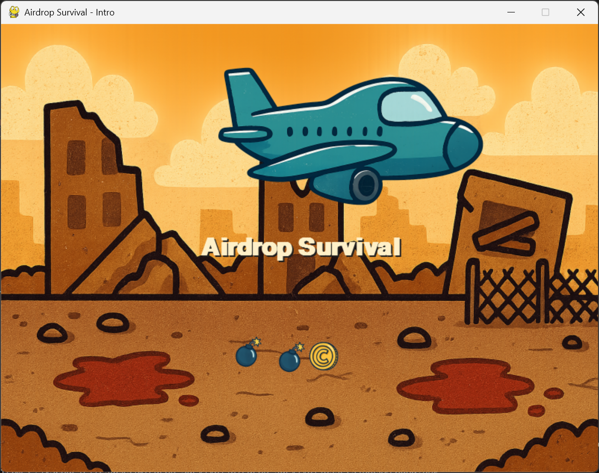
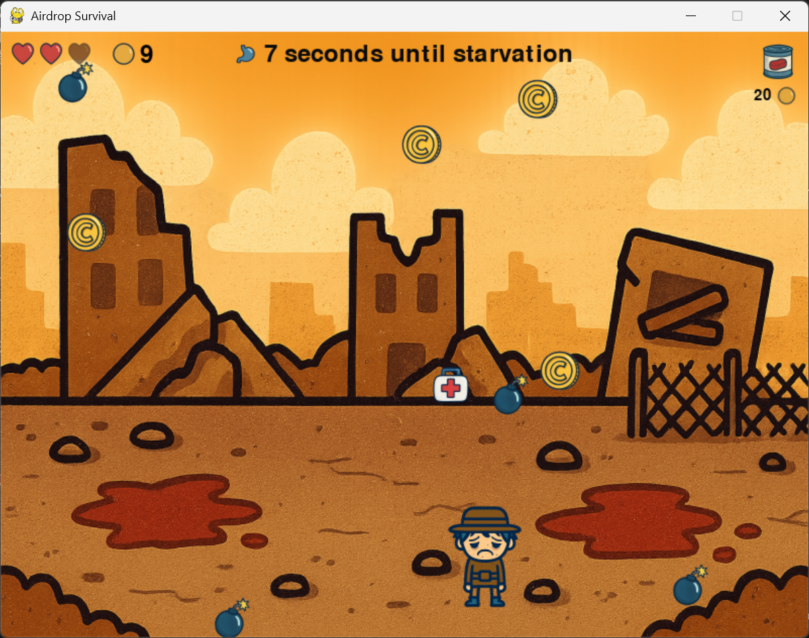
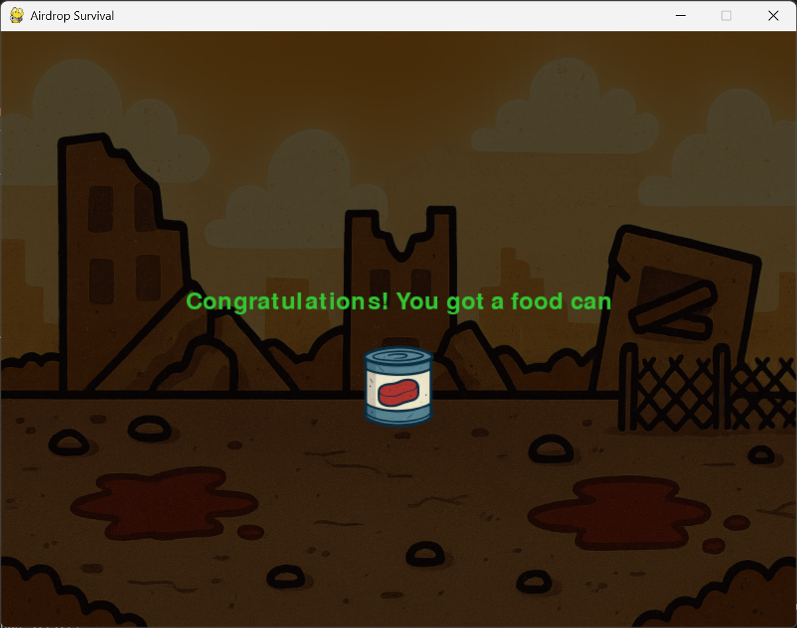
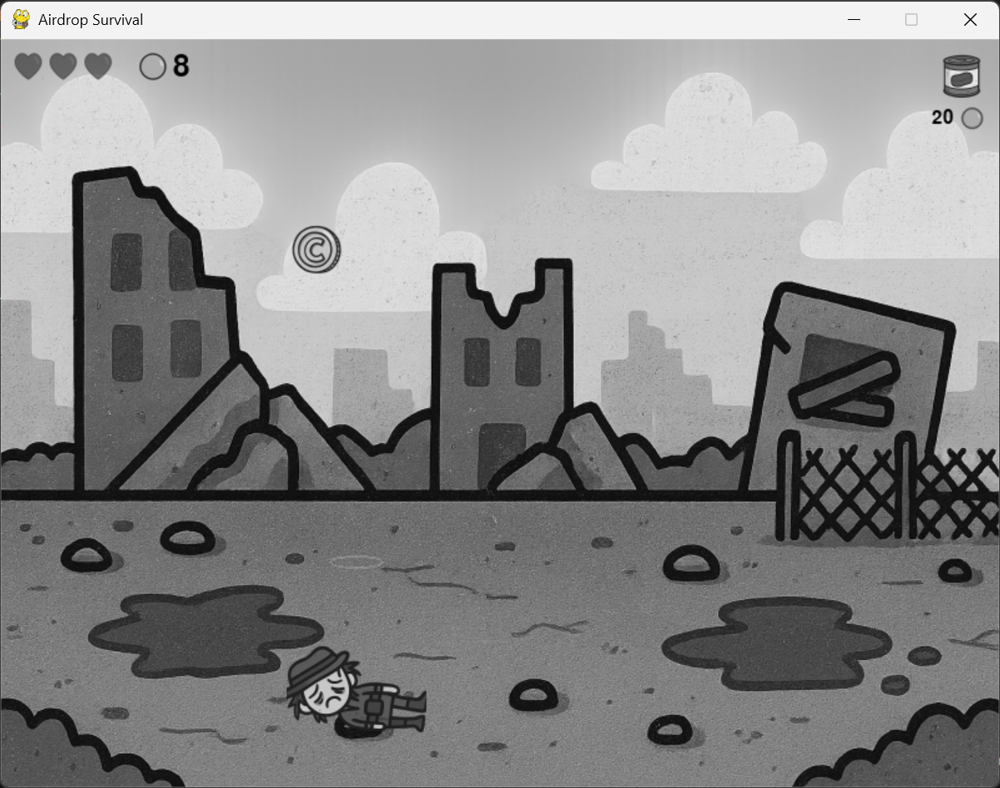
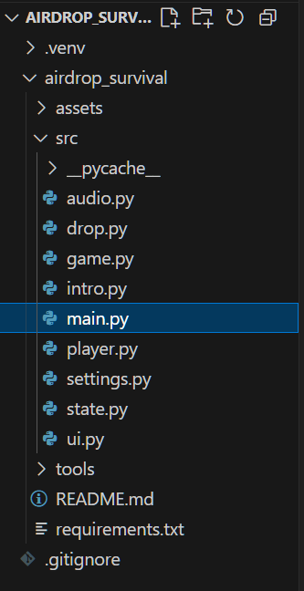

# Airdrop Survival — English README

## Introduction

This is a small Pygame demo about surviving airdrops in a post‑apocalyptic setting. A high‑altitude plane continuously drops bombs, coins, and health packs. You must move left/right to dodge bombs, collect coins/health, and survive until the level timer runs out while meeting the target coin goal to obtain food and avoid starvation. The repository contains a complete runnable project with sound effects and example assets. Audio/BGM are optional: if missing, the game runs silently.


## Demo

🎥 Demo video: https://youtu.be/3dZ-QFR_xRI 







## How to Run

Prerequisites
- Python 3.9+ (3.10+ recommended)
- Dependencies: `pygame>=2.6.0`, `numpy`

Quick start (Windows / PowerShell)
```powershell
# Clone and cd
git clone https://github.com/CAOZiy1/Airdrop_Survival.git
cd Airdrop_Survival

# Optional: use a virtual environment
python -m venv .venv
\.\.venv\Scripts\Activate.ps1

# Install dependencies
python -m pip install -U pip
pip install -r requirements.txt

# Run the main program (Intro first, then Game)
python .\airdrop_survival\src\main.py
```

Example entry file:


Optional assets
- If you’re missing basic PNGs, you can quickly create placeholders:
```powershell
python .\airdrop_survival\tools\generate_assets.py
```


## Input and Feedback

Input
- Keyboard: Arrow Left/Right or A/D to move (supports long press)
- Mouse: In the Intro scene, click “ENTER GAME” to start; on the result screen, click "Back to Menu" or "Quit"

Reference screenshot:


Feedback
- Visual: Top‑left HUD shows hearts (lives) and coins; top‑right shows goal/reward hints; +1 floaters appear on pickups; injury/death overlays; optional background image; a top message "XX seconds until starvation"
- Audio: BGM prefers `assets/sounds/bgm.mp3`, falls back to `bgm.wav`; pickup/explosion/heal/end SFX are played when present (silently skipped if missing)
- Rules: After 60 seconds, win/lose is decided by coin count; success plays success.wav, failure plays failure.wav and shows the result screen. Dying within 60 seconds also plays failure.wav

More shots:


## Project Structure

```
airdrop_survival/
├── README.md
├── requirements.txt
├── assets/
│   ├── sounds/                # BGM and SFX (some procedural/pygame‑generated; some from Pixabay/Chosic)
│   ├── screenshots/           # Screenshots used in documentation
│   └── visual_materials.png   # All visual materials, generated by AI
├── src/
│   ├── main.py                # Entry: play Intro (optional) then start Game
│   ├── game.py                # Main loop, collisions, timer, ending and music control
│   ├── intro.py               # Intro animation, plane pass, ENTER GAME button
│   ├── player.py              # Player control/render (injury/death overlays/animation)
│   ├── drop.py                # Dropped item logic, loading images/SFX and playback
│   ├── ui.py                  # HUD and UI rendering, countdown hints
│   ├── audio.py               # Placeholder for future audio helpers (no synthesized BGM now)
│   ├── settings.py            # Global settings: resolution, speeds, volumes, Intro replay
│   └── state.py               # Runtime flags (e.g., intro_shown)
└── tools/
    ├── check_wav.py           # Validate if success.wav/failure.wav are playable by Pygame
    ├── generate_assets.py     # Generate placeholder PNGs for bomb/coin/health pack
    ├── generate_sfx.py        # Procedurally generate short SFX (coin/heal/explosion)
    ├── make_transparent.py    # Remove near‑white backgrounds (make transparent)
    └── test_grayscale.py      # Demonstrate numpy surfarray grayscale; saves assets/screenshots/grayscale_test.png
```

Important files
- Ending music: `assets/sounds/success.wav`, `assets/sounds/failure.wav` (recommended: PCM 16‑bit / 44100 Hz WAV for best compatibility)
- Background BGM: prefers `assets/sounds/bgm.mp3`, falls back to `bgm.wav`
- Intro plays only on the first entry of this process; `REPLAY_INTRO_ON_RETURN` in `src/settings.py` controls replay when returning to menu


## Implementation Mapping

- Input and main loop: `src/game.py` (event loop, keyboard input, timer, results, music switch)
- Player rendering/state: `src/player.py` (movement, injury/death overlay and sizing)
- Drops and SFX: `src/drop.py` (load images/SFX, update/render, play pickup/explosion/heal SFX)
- HUD and UI: `src/ui.py` (hearts/coins, top‑right goal hints, center countdown, result screen)
- Intro animation: `src/intro.py` (plane flyby, three‑stage drop, darken, Enter button)
- Ending music switch: `src/game.py::_play_ending_music` (stop BGM, play success/failure)
- Optional audio helper: `src/audio.py` (currently placeholder, no BGM synthesis)


## How This Meets Assignment Objectives

- Python‑first implementation: core logic written in Python (Pygame) under `src/`
- At least one user input: keyboard (Left/Right or A/D) and mouse clicks, with immediate feedback
- Real‑time feedback: pickups, damage, death, and result transition include visual + audio; safe fallback when assets are missing
- State‑driven logic: hearts/coins/timer drive win/loss branches
- Creativity/aesthetics: tension via countdown, accelerated drops, and SFX design


## Audio credits

Sources and licenses for in‑project audio:

- success.wav, failure.wav — from Pixabay search “game end”  
  https://pixabay.com/sound-effects/search/game%20end/  
  License: Pixabay License (commercial use allowed, attribution not required; attribution to creator/platform is appreciated)

- plane_loop.wav — from Pixabay search “airplane engine”  
  https://pixabay.com/sound-effects/search/airplane-engine/  
  License: Pixabay License

- drop_thud.wav — from Pixabay search “metal impact”  
  https://pixabay.com/sound-effects/search/metal%20impact/  
  License: Pixabay License

- bgm.mp3 (or bgm.wav) — from Chosic free‑music search (keyword “run amok”)  
  https://www.chosic.com/free-music/all/?keyword=run%20amok  
  Example attribution if you use Kevin MacLeod’s “Run Amok”:  
  “Run Amok” by Kevin MacLeod (incompetech.com)  
  Licensed under Creative Commons: Attribution 3.0  
  http://creativecommons.org/licenses/by/3.0/

- Other short SFX (coin_pickup.wav, heal_pickup.wav, bomb_explosion.wav) — procedurally generated. See `tools/generate_sfx.py` to reproduce (44100 Hz, 16‑bit PCM WAV).


## Visual assets credits

Visual assets in this project were generated using Microsoft Copilot AI, based on user‑provided prompts. These images are original creations and used solely for demonstration and educational purposes.


## Notes

- Built with Pygame; please use royalty‑free or self‑created assets and include proper credits in the README  
- If ending music fails to play, check the console or run `tools/check_wav.py` to validate `assets/sounds/success.wav` and `failure.wav`  
- `src/settings.py` exposes many tunables (drop speeds/weights, volumes, Intro replay) for quick demo adjustments


## In The End
Have fun, and feel free to extend with more levels and mechanics!


---

# Airdrop Survival Intro Module（中文 README）

## Introduction

这是一个末日背景的“空投生存”游戏demo。高空的飞机会不断投掷炸弹、金币和回血包；你需要左右移动去躲避炸弹、收集金币/回血包，并在关卡倒计时结束前存活并达到目标金币数，以换取食物避免饿死。该仓库包含完整可运行的 Pygame 项目、音效与示例资产（音效与 BGM 可选，缺失时游戏会静默运行）。


## Demo

🎥 Demo video: https://youtu.be/3dZ-QFR_xRI 


## How to Run

前置要求
- Python 3.9 或更高（推荐 3.10+）
- 依赖：`pygame>=2.6.0`、`numpy`

快速运行（Windows / PowerShell）
```powershell

# 克隆仓库并进入目录
git clone https://github.com/CAOZiy1/Airdrop_Survival.git
cd Airdrop_Survival

# 建议在虚拟环境中安装依赖
python -m venv .venv
\.\.venv\Scripts\Activate.ps1

# 安装依赖
python -m pip install -U pip
pip install -r requirements.txt

# 运行主程序（会先播 Intro 动画，再进入 Game）
python .\airdrop_survival\src\main.py

```
如何运行主程序（示例）：


可选安装与素材
- 若缺少基本 PNG 素材，可生成占位图以快速体验：
```powershell
python .\airdrop_survival\tools\generate_assets.py
```


## Input and Feedback

Input
- 键盘: 左右方向键 或 A / D 控制玩家移动（支持长按）。
- 鼠标: 在 Intro 场景点击 “ENTER GAME” 按钮以开始；结算界面可点击 "Back to Menu" 或 "Quit"。

参考截图：


Feedback
- 视觉反馈: 左上角数值面板显示生命（心数）、金币，右上角目标奖励提示；拾取金币/医疗包显示 +1 浮动文字；受伤/死亡显示覆盖图；可选背景图；顶部显示“XX seconds until starvation” 倒计时条目。
- 听觉反馈: 背景 BGM 优先加载 `assets/sounds/bgm.mp3`，无则尝试 `bgm.wav`；拾取/爆炸/治疗/结局尝试播放对应音效（缺失时静默）。
- 规则反馈: 60 秒后按金币数评判胜负；胜利播放 success.wav，失败播放 failure.wav 并显示结算界面。60 秒内死亡，也会播放 failure.wav

参考截图：


## Project Structure

```
airdrop_survival/
├── README.md
├── requirements.txt
├── assets/
│   ├── sounds/                # BGM 与音效（部分为程序化/pygame 生成，部分源于 Pixabay 与 Chosic）
│   ├── screenshots/           # 截图（可自行创建，辅助instruction）
│   └── visual_materials.png   # 所有的美术素材，均由AI生成
├── src/
│   ├── main.py                # 入口：播放 Intro（若需要）然后启动 Game
│   ├── game.py                # 主循环、碰撞、计时、结局与结局音乐控制
│   ├── intro.py               # 开场动画、飞机投放、ENTER GAME 按钮
│   ├── player.py              # 玩家控制与渲染（受伤、死亡覆盖图/动画）
│   ├── drop.py                # 掉落物逻辑、图像/音效加载与播放
│   ├── ui.py                  # HUD 与界面绘制、倒计时提示
│   ├── audio.py               # 预留：音频辅助（当前无合成 BGM）
│   ├── settings.py            # 全局设置：分辨率、速度、音量、Intro 重播等
│   └── state.py               # 运行时状态标记（例如 intro_shown）
└── tools/
    ├── check_wav.py           # 检查 success.wav/failure.wav 等是否可被 Pygame 播放
    ├── generate_assets.py     # 生成炸弹/硬币/医疗包占位图（PNG）
    ├── generate_sfx.py        # 程序化生成部分短音效（coin/heal/explosion）
    ├── make_transparent.py    # 将近白背景变透明的小工具
    └── test_grayscale.py      # 验证/演示 numpy surfarray 灰度化流程，保存截图 assets/screenshots/grayscale_test.png
```

重要文件说明
- 结局音乐文件：`assets/sounds/success.wav` 与 `assets/sounds/failure.wav`（推荐 PCM 16-bit / 44100Hz WAV 以确保兼容性）。
- 背景 BGM：优先 `assets/sounds/bgm.mp3`，无则尝试 `bgm.wav`。
- Intro 仅在本进程第一次进入时播放；`src/settings.py` 的 `REPLAY_INTRO_ON_RETURN` 控制返回菜单时是否重播。


## Implementation Mapping

- 玩家输入与主循环: `src/game.py`（事件循环、键盘输入、关卡计时、结算与音乐切换）。
- 玩家渲染与状态: `src/player.py`（移动、受伤/死亡覆盖图与绘制尺寸控制）。
- 掉落物逻辑与音效: `src/drop.py`（加载图片/音效、更新/绘制、播放拾取/爆炸/治疗音效）。
- HUD 与 UI: `src/ui.py`（生命、金币、右上角目标提示、中心倒计时与结算界面）。
- Intro 动画: `src/intro.py`（飞机飞行、三段投放、渐暗与 Enter 按钮）。
- 结局音乐和切换逻辑: `src/game.py::_play_ending_music`（停止 BGM、播放成功/失败音乐）。
- 可选音频辅助: `src/audio.py`（当前为占位，不再合成 BGM）。


## How This Meets Assignment Objectives

- Python 为主实现: 项目以 Python（Pygame）编写，所有交互逻辑位于 `src/` 下。
- 至少一种用户输入: 实现键盘（左右/A D）和鼠标点击交互，触发即时反馈。
- 实时反馈机制: 拾取、受伤、死亡、结算切换均有视觉与音频反馈；缺素材时安全降级。
- 状态管理与交互逻辑: hearts（生命）、coins（金币）、timer（倒计时）驱动成功/失败分支。
- 创意与审美整合: 通过倒计时、加速掉落与声效设计，营造紧张的生存体验。


## Audio credits（音频致谢）

以下为项目内音频文件的来源与授权说明：

- success.wav、failure.wav — 来源：Pixabay 搜索“game end” 结果集  
    链接：https://pixabay.com/sound-effects/search/game%20end/  
    授权：Pixabay License（可商用、无须署名；如可请致谢创作者/平台）。

- plane_loop.wav — 来源：Pixabay 搜索“airplane engine” 结果集  
    链接：https://pixabay.com/sound-effects/search/airplane-engine/  
    授权：Pixabay License（可商用、无须署名）。

- drop_thud.wav — 来源：Pixabay 搜索“metal impact” 结果集  
    链接：https://pixabay.com/sound-effects/search/metal%20impact/  
    授权：Pixabay License（可商用、无须署名）。

- bgm.mp3（或 bgm.wav）— 来源：Chosic 免费音乐搜索（关键词 “run amok”）  
    链接：https://www.chosic.com/free-music/all/?keyword=run%20amok  
    备注：“Run Amok” by Kevin MacLeod (incompetech.com)  
    Licensed under Creative Commons: Attribution 3.0  
    http://creativecommons.org/licenses/by/3.0/

- 其他短音效（如 coin_pickup.wav、heal_pickup.wav、bomb_explosion.wav）— 程序化生成（Procedural SFX）。本仓库提供 `tools/generate_sfx.py`，可一键再生成到 `assets/sounds/`（44100Hz、16-bit PCM WAV）。


## Visual assets credits（美术素材来源）

- 美术素材由 Microsoft Copilot AI 生成，基于用户描述自动创作。所有生成图像仅用于本项目展示与教育目的。


## Notes

- 代码基于 Pygame；音效与素材请使用免版权或自行创作的资源，并在 README 中注明第三方素材来源与授权信息。  
- 若结局音乐无法播放，请查看终端日志或使用 `tools/check_wav.py` 校验 `assets/sounds/success.wav` 与 `failure.wav` 的格式与可播放性。  
- `src/settings.py` 提供了大量可调参数（掉落速度、权重、音量、Intro 重播等），可根据演示需要快速调优。


## In The End
祝你玩得开心，也欢迎继续扩展更多关卡与玩法！